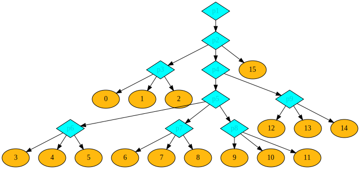
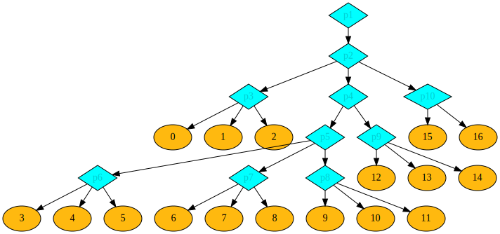

# Persistent Data

Calcit uses [rpds](https://github.com/orium/rpds) for HashMap and HashSet, and use [Ternary Tree](https://github.com/calcit-lang/ternary-tree.rs/) in Rust.

For Calcit-js, it's all based on [ternary-tree.ts](https://github.com/calcit-lang/ternary-tree.ts), which is my own library. This library is quite naive and you should not count on it for good performance.

### Optimizations for vector in Rust

Although named "ternary tree", it's actually unbalanced 2-3 tree, with tricks learnt from [finger tree](https://en.wikipedia.org/wiki/Finger_tree) for better performance on `.push_right()` and `.pop_left()`.

* [ternary-tree initial idea(old)](https://clojureverse.org/t/ternary-tree-structure-sharing-data-for-learning-purpose/6760)
* [Intro about optimization learnt from FingerTree(Chinese)](https://www.bilibili.com/video/BV1z44y1a7a6/)
* [internal tree layout from size 1~59](https://www.bilibili.com/video/BV1or4y1U7u2?spm_id_from=333.999.0.0)

For example, this is the internal structure of vector `(range 14)`:

when a element `14` is pushed at right, it's simply adding element at right, creating new path at a shallow branch, which means littler memory costs(compared to deeper branches):

and when another new element `15` is pushed at right, the new element is still placed at a shallow branch. Meanwhile the previous branch was pushed deeper into the middle branches of the tree:

so in this way, we made it cheaper in pushing new elements at right side.
These steps could be repeated agained and again, new elements are always being handled at shallow branches.

This was the trick learnt from finger tree. The library Calcit using is not optimal, but should be fast enough for many cases of scripting.
